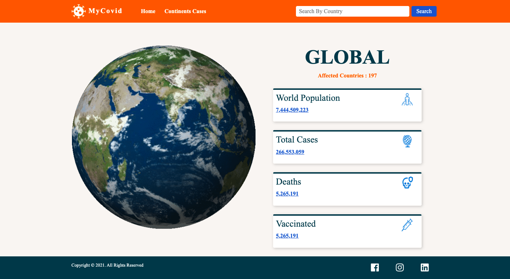
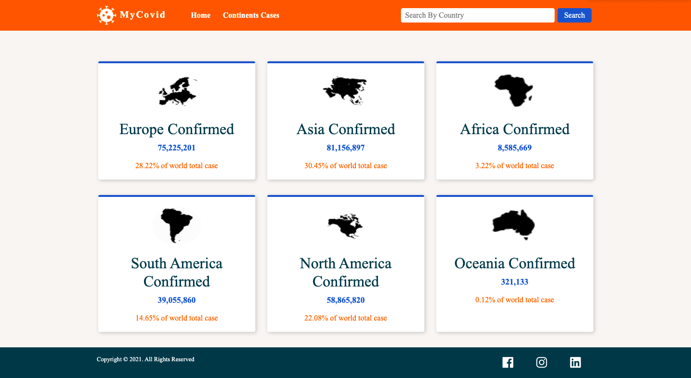
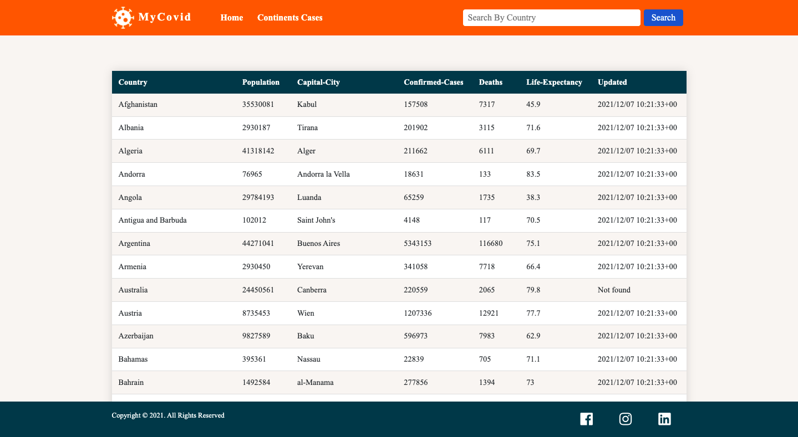

# HackMyCovid - simple website for corona statistics in the world - <a href="">Demo</a>

The SPA with 3 pages (routes):

- A Homepage show the global cases (Countries affected, Population, Confirmed cases, Deaths, Vaccinated cases) :

&nbsp;

- Continents page that show the Confirmed cases in each continent and how much is a percentage for the world :

&nbsp;

- Search page that show many information about all the country in the world, with the ability to search for a specific country :

&nbsp;

&nbsp;

## Getting Started

To get started you can simply clone the repo and open covid.html

## Application:

ES6 + Features

Arrow Functions

Block-Scoped Variables Let and Const

async await with try/catch

Modules export/import

## Covid-19-API

The API is intended for developers, machines, programs, and other websites to be able to quickly fetch up to date information on the COVID-19 epidemic.

It can be used to build tools and systems that are used for data analysis all the way to websites that act as public dashboards and charts.

API base:
https://covid-api.mmediagroup.fr/v1

## Further Amendments to be made ?

As a result of one week task i have completed the above mentioned task but in future i want to make this app responsive and also add some more features:

1. Show the increase and decrease (confirmed, deaths, vaccinated) cases from day to day.
2. Use graph to show the difference in cases of corona
3. Add information about the cities in the countries.

Please feel free to send me your feedback . I would love to hear from you . 
